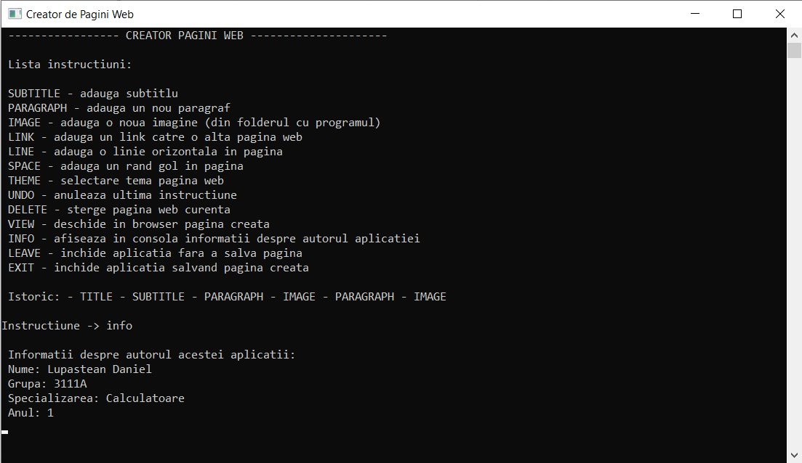
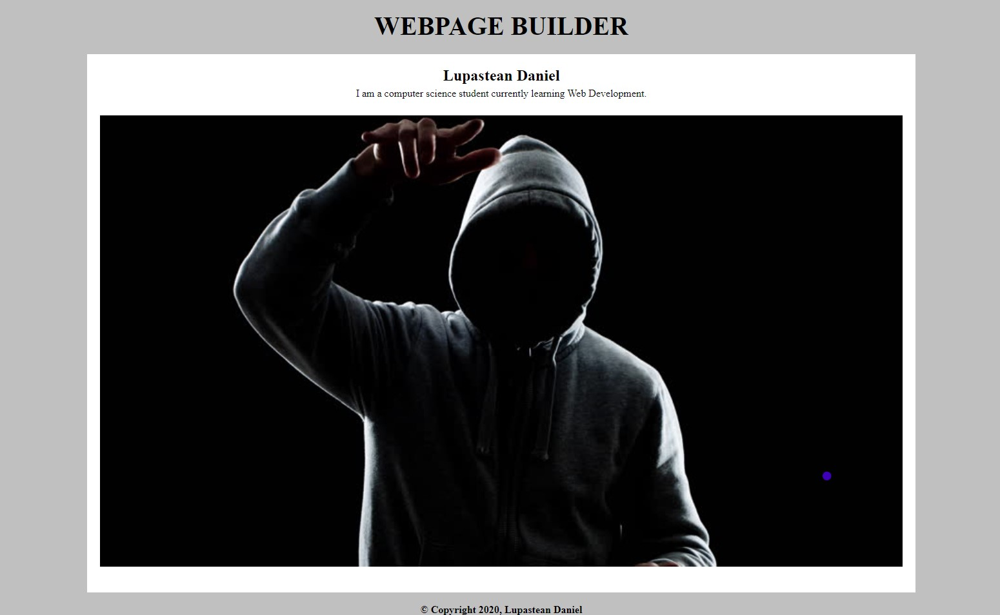

## CLI Webpage Builder
### Academic Programming Project - 2020

- command line interface app
- built with C
- generates simple webpages according to the user's preference
- built-in "Undo" system using a stack

#### App Preview:

#### Generated Webpage Example:

